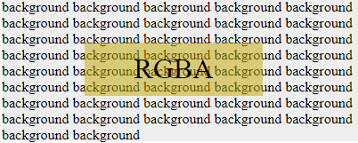
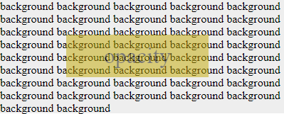

## CSS篇
- [a标签上四个伪类的执行顺序是怎么样的？](#a标签上四个伪类的执行顺序是怎么样的)
- [css 属性 content 有什么作用？](#css-属性-content-有什么作用)
- [伪元素和伪类的区别和作用？](#伪元素和伪类的区别和作用)
- [::before 和 :after 中双冒号和单冒号有什么区别？](#before-和-after-中双冒号和单冒号有什么区别)
- [在CSS样式中常使用 px、em 、rem的区别](#在css样式中常使用-pxem-rem的区别)
- [你对 line-height 是如何理解的？](#你对-line-height-是如何理解的)
- [line-height 三种赋值方式有何区别？（带单位、纯数字、百分比）](#line-height-三种赋值方式有何区别带单位纯数字百分比)
- [display: none; 与 visibility: hidden; 的区别](#display-none-与-visibility-hidden-的区别)
- [rgba() 与 opacity的区别](#rgba-与-opacity的区别)
- [盒模型的理解](#盒模型的理解)
- [relative、fixed、absolute和static四种定位的区别](#relativefixedabsolute和static四种定位的区别)
- [block, inline和inline-block有什么区别？](#block-inline和inline-block有什么区别)
- [flexbox布局](#flexbox布局)
- [栅格布局(grid)](#栅格布局grid)
- [居中布局](#居中布局)
- [选择器优先级](#选择器优先级)
- [解释浏览器如何确定哪些元素与 CSS 选择器匹配](#解释浏览器如何确定哪些元素与-css-选择器匹配)
- [CSS预处理器(Sass/Less)的优缺点分别是什么？](#css预处理器sassless的优缺点分别是什么)
- [link 与 @import 的区别](#link-与-import-的区别)
- [经常遇到的浏览器的兼容性有哪些？原因，解决方法是什么，常用hack的技巧 ？](#经常遇到的浏览器的兼容性有哪些原因解决方法是什么常用hack的技巧-)
- [CSS优化、提高性能的方法有哪些？](#css优化提高性能的方法有哪些)
- [抽离样式模块怎么写，说出思路？](#抽离样式模块怎么写说出思路)
- [什么是响应式设计？响应式设计的基本原理是什么？如何兼容低版本的IE？](#什么是响应式设计响应式设计的基本原理是什么如何兼容低版本的ie)
- [用纯CSS创建一个三角形的原理是什么?](#用纯css创建一个三角形的原理是什么)
- [什么情况下，用translate()而不用绝对定位？什么时候，情况相反。](#什么情况下用translate而不用绝对定位什么时候情况相反)
- [对BFC规范(块级格式化上下文：block formatting context)的理解？](#对bfc规范块级格式化上下文block-formatting-context的理解)
- [对CSS浮动Float的理解](#对css浮动float的理解)
- [CSS动画的理解](#css动画的理解)
- [最后推荐一本由CSS大神Lea Verou著, CSS魔法译的书](#最后推荐一本由css大神lea-verou著-css魔法译的书)

### a标签上四个伪类的执行顺序是怎么样的？
link > visited > hover > active

- L-V-H-A love hate 用喜欢和讨厌两个词来方便记忆

### css 属性 content 有什么作用？
content 属性专门应用在 before/after 伪元素上，用于插入额外内容或样式。可减少标签的使用。

### 伪元素和伪类的区别和作用？
- 伪元素 -- 在内容元素的前后插入额外的元素或样式，但是这些元素实际上并不在文档中生成。
- 它们只在外部显示可见，但不会在文档的源代码中找到它们，因此，称为“伪”元素。例如：

        p::before {content:"第一章：";}
        p::after {content:"Hot!";}
        p::first-line {background:red;}
        p::first-letter {font-size:30px;}

- 伪类 -- 将特殊的效果添加到特定选择器上。它是已有元素上添加类别的，不会产生新的元素。例如：
a:hover {color: #FF00FF}
p:first-child {color: red}

### ::before 和 :after 中双冒号和单冒号有什么区别？
- 在 CSS 中伪类一直用 : 表示，如 :hover, :active 等
- 伪元素在CSS1中已存在，当时语法是用 : 表示，如 :before 和 :after
- 后来在CSS3中修订，伪元素用 :: 表示，如 ::before 和 ::after，以此区分伪元素和伪类
- 由于低版本IE对双冒号不兼容，开发者为了兼容性各浏览器，继续使使用 :after 这种老语法表示伪元素
- 综上所述：::before 是 CSS3 中写伪元素的新语法； :after 是 CSS1 中存在的、兼容IE的老语法

### 在CSS样式中常使用 px、em 、rem的区别
- px（绝对长度单位）
    - 在缩放页面时无法调整那些使用它作为单位的字体、按钮等的大小
- em（相对长度单位）
    - 浏览器的默认字体都是16px，那么1em=16px，以此类推计算10px=0.625em
    - 为了简化font-size的换算，一般都会在body中写入以下代码
            
            body { font-size: 62.5%; } /*  公式16px*62.5%=10px  */  

    - em的值并不是固定的
    - em会继承父级元素的字体大小（参考物是父元素的font-size）
    - em中所有的字体都是相对于父元素的大小决定的；所以如果一个设置了font-size:1.2em的元素在另一个设置了font-size:1.2em的元素里，而这个元素又在另一个设置了font-size:1.2em的元素里，那么最后计算的结果是1.2X1.2X1.2=1.728em
- rem（相对长度单位）
    - rem单位可谓集相对大小和绝对大小的优点于一身
    - 和em不同的是rem总是相对于根元素(如:root{})，而不像em一样使用级联的方式来计算尺寸。这种相对单位使用起来更简单。
    - rem支持IE9及以上，意思是相对于根元素html（网页），不会像em那样，依赖于父元素的字体大小，而造成混乱。使用起来安全了很多。

### 你对 line-height 是如何理解的？
- line-height 指一行字的高度，包含了字间距，实际上是下一行基线到上一行基线距离
- 如果一个标签没有定义 height 属性，那么其最终表现的高度是由 line-height 决定的
- 一个容器没有设置高度，那么撑开容器高度的是 line-height 而不是容器内的文字内容
- 把 line-height 值设置为 height 一样大小的值可以实现单行文字的垂直居中
- line-height 和 height 都能撑开一个高度，height 会触发 haslayout，而 line-height 不会

### line-height 三种赋值方式有何区别？（带单位、纯数字、百分比）
- 带单位：px 是固定值，而 em 会参考父元素 font-size 值计算自身的行高
- 纯数字：会把比例传递给后代。例如，父级行高为 1.5，子元素字体为 18px，则子元素行高为 1.5 * 18 = 27px
- 百分比：将计算后的值传递给后代

### display: none; 与 visibility: hidden; 的区别
- 联系：它们都能让元素不可见
- 区别：
    - display:none;会让元素完全从渲染树中消失，渲染的时候不占据任何空间；visibility: hidden;不会让元素从渲染树消失，渲染师元素继续占据空间，只是内容不可见
    - display: none;是非继承属性，子孙节点消失由于元素从渲染树消失造成，通过修改子孙节点属性无法显示；visibility:hidden;是继承属性，子孙节点消失由于继承了hidden，通过设置visibility: visible;可以让子孙节点显式
    - 修改常规流中元素的display通常会造成文档重排。修改visibility属性只会造成本元素的重绘
    - 读屏器不会读取display: none元素内容；会读取visibility: hidden元素内容

### rgba() 与 opacity的区别
- **rgba()**

    - 仅仅改变的是背景的透明度
    - 不会对文本造成影响，不具有继承性
    
    
    
- **opacity**

    - 不仅会改变背景的透明度
    - 还会改变文本的透明度，并且具有继承性
    
    

### 盒模型的理解
页面渲染时，dom 元素所采用的 布局模型。可通过box-sizing进行设置。
- content-box (W3C 标准盒模型)

默认值，标准盒子模型。 width 与 height 只包括内容的宽和高， 不包括边框（border），内边距（padding），外边距（margin）。注意: 内边距、边框和外边距都在这个盒子的外部。 比如说，.box {width: 350px; border: 10px solid black;} 在浏览器中的渲染的实际宽度将是 370px。

尺寸计算公式：

width = 内容的宽度

height = 内容的高度

宽度和高度的计算值都不包含内容的边框（border）和内边距（padding）。

- border-box (IE盒模型)

 width 和 height 属性包括内容，内边距和边框，但不包括外边距。这是当文档处于 Quirks模式 时Internet Explorer使用的盒模型。注意，填充和边框将在盒子内 , 例如, .box {width: 350px; border: 10px solid black;} 导致在浏览器中呈现的宽度为350px的盒子。内容框不能为负，并且被分配到0，使得不可能使用border-box使元素消失。

尺寸计算公式：

width = border + padding + 内容的宽度

height = border + padding + 内容的高度

- https://developer.mozilla.org/zh-CN/docs/Web/CSS/box-sizing

### relative、fixed、absolute和static四种定位的区别
经过定位的元素，其position属性值必然是relative、absolute、fixed或sticky。

- static：默认定位属性值。该关键字指定元素使用正常的布局行为，即元素在文档常规流中当前的布局位置。此时 top, right, bottom, left 和 z-index 属性无效。
- relative：该关键字下，元素先放置在未添加定位时的位置，再在不改变页面布局的前提下调整元素位置（因此会在此元素未添加定位时所在位置留下空白）。
- absolute：不为元素预留空间，通过指定元素相对于最近的非 static 定位祖先元素的偏移，来确定元素位置。绝对定位的元素可以设置外边距（margins），且不会与其他边距合并。
- fixed：不为元素预留空间，而是通过指定元素相对于屏幕视口（viewport）的位置来指定元素位置。元素的位置在屏幕滚动时不会改变。打印时，元素会出现在的每页的固定位置。fixed 属性会创建新的层叠上下文。当元素祖先的 transform 属性非 none 时，容器由视口改为该祖先。
- sticky：盒位置根据正常流计算(这称为正常流动中的位置)，然后相对于该元素在流中的 flow root（BFC）和 containing block（最近的块级祖先元素）定位。在所有情况下（即便被定位元素为 table 时），该元素定位均不对后续元素造成影响。当元素 B 被粘性定位时，后续元素的位置仍按照 B 未定位时的位置来确定。position: sticky 对 table 元素的效果与 position: relative 相同。

### block, inline和inline-block有什么区别？
||block	|inline-block |inline|
|---|---|---|---|
|大小|填充其父容器的宽度|取决于内容|取决于内容|
|定位|从新的一行开始，并且不允许旁边有 HTML 元素（除非是float）|与其他内容一起流动，并允许旁边有其他元素|与其他内容一起流动，并允许旁边有其他元素。
|能否设置width和height|能|能|不能 设置会被忽略|
|可以使用vertical-align对齐|不可以|可以	|可以|
|边距（margin）和填充（padding）	|各个方向都存在	|各个方向都存在	|只有水平方向存在。垂直方向会被忽略。 尽管border和padding在content周围，但垂直方向上的空间取决于'line-height'|
|浮动（float）|	-	|-	|就像一个block元素，可以设置垂直边距和填充。|

### flexbox布局
- http://www.ruanyifeng.com/blog/2015/07/flex-grammar.html
- http://www.ruanyifeng.com/blog/2015/07/flex-examples.html

### 栅格布局(grid)
- http://www.ruanyifeng.com/blog/2019/03/grid-layout-tutorial.html

### 居中布局
**水平居中**
- 行内元素(inline-block): text-align: center
- 块级元素: margin: 0 auto
- absolute + transform
- flex + justify-content: center

**垂直居中**
- line-height: height
- absolute + transform
- flex + align-items: center
- table

**水平垂直居中**
- absolute + transform
- flex + justify-content + align-items

### 选择器优先级
!important > 行内样式 > #id > .class > tag > * > 继承 > 默认

选择器 从右往左 解析

- 相同权重，定义最近者为准：行内样式 > 内部样式 > 外部样式
- 含外部载入样式时，后载入样式覆盖其前面的载入的样式和内部样式
- 选择器优先级: 行内样式[1000] > id[100] > class[10] > Tag[1]
- 在同一组属性设置中，!important 优先级最高，高于行内样式

### 解释浏览器如何确定哪些元素与 CSS 选择器匹配
浏览器从最右边的选择器（关键选择器）开始查找，根据关键选择器，浏览器从 DOM 中筛选出元素，然后向上遍历被选元素的父元素，判断是否匹配。

例如，对于形如p span的选择器，浏览器首先找到所有\<span\>元素，并遍历它的父元素直到根元素以找到\<p\>元素。对于特定的\<span\>，只要找到一个\<p\>，就知道已经匹配并停止继续匹配。

基于以上原理，为了编写高效CSS，应注意以下几点：
- 避免使用标签和通用选择器作为关键选择器。因为它们会匹配大量的元素，浏览器必须要进行大量的工作，去判断这些元素的父元素们是否匹配
- 选择器匹配语句链越短，浏览器的匹配速度越快
- 搞清楚哪些 CSS 属性会触发重新布局（reflow）、重绘（repaint）和合成（compositing）。在写样式时，避免触发重新布局的可能。

### CSS预处理器(Sass/Less)的优缺点分别是什么？
- CSS 预处理器基本思想：为 CSS 增加了一些编程的特性（变量、逻辑判断、函数等）
- 开发者使用这种语言进行进行 Web 页面样式设计，再编译成正常的 CSS 文件使用
- 使用 CSS 预处理器，可以使 CSS 更加简洁、适应性更强、可读性更佳，无需考虑兼容性
- 最常用的 CSS 预处理器语言包括：Sass（SCSS）和 Less

优点：
- 提高 CSS 可维护性
- 易于编写嵌套选择器
- 引入变量，增添主题功能。可以在不同的项目中共享主题文件
- 通过混合（Mixins）生成可复用的 CSS
- 将代码分割成多个文件。不进行预处理的 CSS，虽然也可以分割成多个文件，但需要建立多个 HTTP 请求加载这些文件

缺点：
- 需要预处理工具
- 重新编译的时间可能会很慢

区别：
- Less 用 JavaScript 实现，与 NodeJS 高度结合
- Less 中，变量名称以@作为前缀，容易与 CSS 关键字混淆，如@media、@import和@font-face
- 通过node-sass使用 Sass，它用 C ++ 编写的 LibSass 绑定。在 Node 版本切换时，必须经常重新编译。

### link 与 @import 的区别
- link功能较多，可以定义 RSS，定义 Rel 等作用，而@import只能用于加载 css
- 当解析到link时，页面会同步加载所引的 css，而@import所引用的 css 会等到页面加载完才被加载
- @import需要 IE5 以上才能使用
- 浏览器对 link 支持早于 @import ，可以使用 @import 对老浏览器隐藏样式
- link可以使用 js 动态引入，@import不行
- @import 必须在样式规则之前，可以在css文件中引用其他文件
- 总体来说：link优于@import

### 经常遇到的浏览器的兼容性有哪些？原因，解决方法是什么，常用hack的技巧 ？
- 浏览器默认的margin和padding不同。解决方案是加一个全局的*{margin:0;padding:0;}来统一
- IE下,even对象有x,y属性,但是没有pageX,pageY属性
- Firefox下,event对象有pageX,pageY属性,但是没有x,y属性

### CSS优化、提高性能的方法有哪些？
- 多个css合并，尽量减少HTTP请求
- 将css文件放在页面最上面
- 移除空的css规则
- 避免使用CSS表达式
- 选择器优化嵌套，尽量避免层级过深
- 充分利用css继承属性，减少代码量
- 抽象提取公共样式，减少代码量
- 属性值为0时，不加单位
- 属性值为小于1的小数时，省略小数点前面的0
- css雪碧图

### 抽离样式模块怎么写，说出思路？
CSS可以拆分成2部分：公共CSS 和 业务CSS：
- 网站的配色，字体，交互提取出为公共CSS。这部分CSS命名不应涉及具体的业务
- 对于业务CSS，需要有统一的命名，使用公用的前缀。可以参考面向对象的CSS

### 什么是响应式设计？响应式设计的基本原理是什么？如何兼容低版本的IE？
- 响应式设计就是网站能够兼容多个终端，而不是为每个终端做一个特定的版本
- 基本原理是利用CSS3媒体查询，为不同尺寸的设备适配不同样式
- 对于低版本的IE，可采用JS获取屏幕宽度，然后通过resize方法来实现兼容

        $(window).resize(function () {
            screenRespond();
        });
        screenRespond();

        function screenRespond(){
            var screenWidth = $(window).width();
            if(screenWidth <= 1800){
                $("body").attr("class", "w1800");
            }
            if(screenWidth <= 1400){
                $("body").attr("class", "w1400");
            }
            if(screenWidth > 1800){
                $("body").attr("class", "");
            }
        }

### 用纯CSS创建一个三角形的原理是什么?
    // 把上、左、右三条边隐藏掉（颜色设为 transparent）
    #demo {
    width: 0;
    height: 0;
    border-width: 20px;
    border-style: solid;
    border-color: transparent transparent red transparent;
    }

### 什么情况下，用translate()而不用绝对定位？什么时候，情况相反。
- translate()是transform的一个值。改变transform或opacity不会触发浏览器重新布局（reflow）或重绘（repaint），只会触发复合（compositions）
- 改变绝对定位会触发重新布局，进而触发重绘和复合 
- transform使浏览器为元素创建一个 GPU 图层，但改变绝对定位会使用到 CPU。 
- 因此translate()更高效，可以缩短平滑动画的绘制时间。

当使用translate()时，元素仍然占据其原始空间（有点像position：relative），这与改变绝对定位不同。

### 对BFC规范(块级格式化上下文：block formatting context)的理解？
- https://segmentfault.com/a/1190000006740129#articleHeader0
- https://www.cnblogs.com/fsjohnhuang/p/5259121.html
- https://www.w3cplus.com/css/understanding-css-layout-block-formatting-context.html

### 对CSS浮动Float的理解
- https://segmentfault.com/a/1190000014554601

### CSS动画的理解
- translate
- transform
- animation
- transtion

### 最后推荐一本由CSS大神Lea Verou著, CSS魔法译的书
> 一本为新一代CSS所写的新一代CSS图书。在我所知的技术专家中，没人比Lea Verou更能领会新一代CSS的精髓。  ——Jeffrey Zeldman, 《网站重构》作者
- [CSS揭秘](https://item.jd.com/11911279.html)
